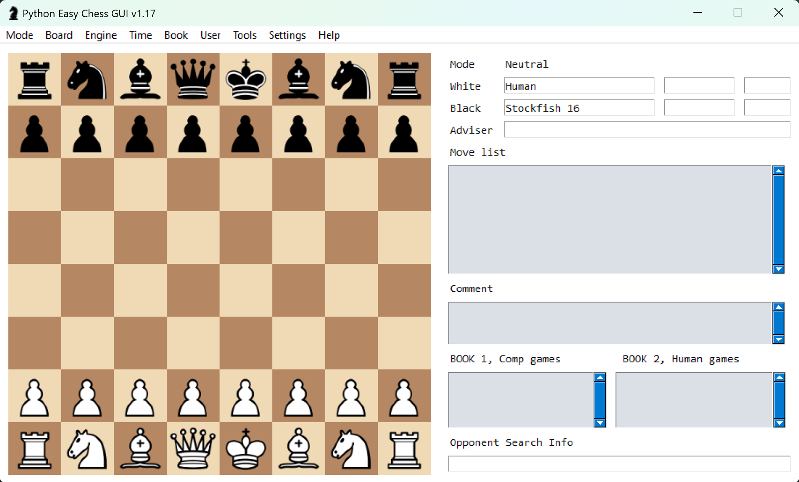
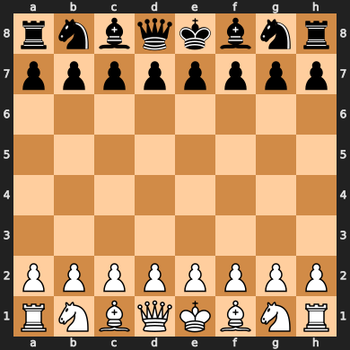
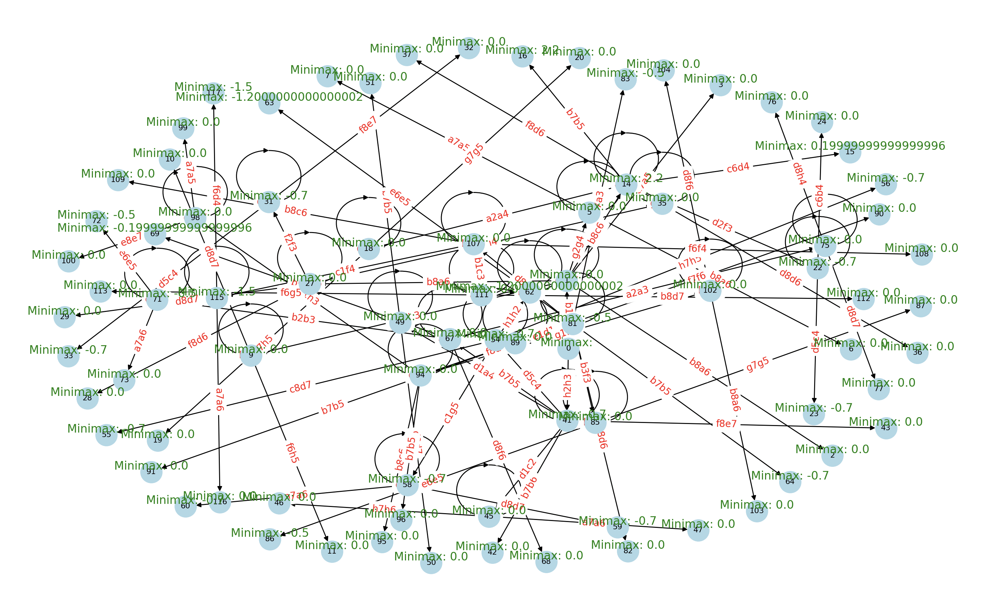
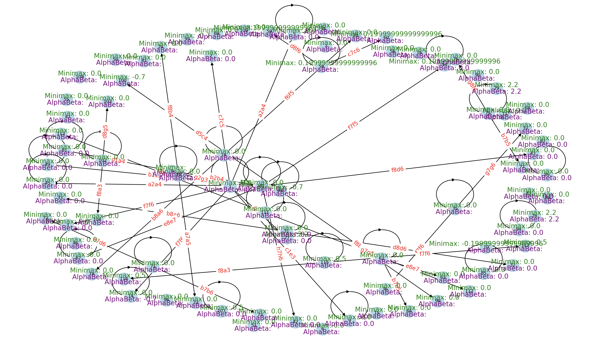

[](https://classroom.github.com/open-in-codespaces?assignment_repo_id=16622161)
# Homework - Adversarial Search ♔♕♗♘♙♖

Topics: Minimax and AlphaBeta

For this assignment you will be making your own chessbot taking advantage of the search techniques discussed in class. You do not need to program the rules of chess in order to complete this assignment.

## Part 0 - Pre-req

There are some libraries and other software that you will need in order to get started.

### Needed Python Packages

* chess - [pypi.org/project/chess/](https://pypi.org/project/chess/) used for modeling boards, identifying legal moves, and faciliating communication. Install with the command `pip install chess`
* pyinstaller - [pyinstaller.org/](https://pyinstaller.org/) for converting your .py files into .exe executables. Install with the command `pip install pyinstaller`
* chester - [pypi.org/project/chester/](https://pypi.org/project/chester/) runs tournaments of chessbots installed with `pip install chester`
* NetworkX - [networkx.org](https://networkx.org/) for graph generation and rendering. Documentation can be found [here](https://networkx.org/documentation/stable/tutorial.html). To install, use the command `pip install networkx`

```bash
pip install chess pyinstaller chester networkx
```

### Visualizing Games

You can use any visualizer you like to play against an engine. The one we'll recommend is Python Easy Chess GUI (see instructions below) which requires some additional setup.

* PySimpleGUI [github.com/PySimpleGUI/PySimpleGUI](https://github.com/PySimpleGUI/PySimpleGUI) creates a generic GUI. Install with `pip install pysimplegui`
* Pyperclip [github.com/asweigart/pyperclip](https://github.com/asweigart/pyperclip) allows for copy/paste functionality with the GUI. Install with `pip install pyperclip`
* Python Easy Chess GUI [https://github.com/fsmosca/Python-Easy-Chess-GUI](https://github.com/fsmosca/Python-Easy-Chess-GUI) clone this repository in a second directory and run the command `python python_easy_chess_gui.py` to run the program.

When setup correctly, it will look like:



```bash
pip install pysimplegui pyperclip
python python_easy_chess_gui.py
```

It is a good idea to turn off Book Moves (Book > Set Book > Uncheck "Use book") and to limit the depth of the chessbots (Engine > Set Depth > 12) so that some bots don't spend all their time thinking. To add a chessbot, go to Engine > Manage > Install > Add > then select your .exe executable. Simply select the opponent by going to Engine > Set Engine Opponent > and select your bot. When ready to play, click Mode > Play. Visit [https://lczero.org/play/quickstart/](https://lczero.org/play/quickstart/) for other visualizers.

### Engines and Tournaments

To create your executable agent use the command `pyinstaller --onefile random_chess_bot.py` except replace with your agent file. This will create an executable, like `random_chess_bot.exe`, inside of a new directory called `dist`. For simplicity, move this file to the directory with the tournament code. **If you are on Mac**, there is another way to make this program executable by using `chmod +x random_chess_bot.py` in the terminal, but pyinstaller should work as well.

In order to test your agent, you'll need to run it against at least one other strong chessbot executable. Good candidates include:

* Stockfish - recommended and probably the strongest open source chessbot [https://stockfishchess.org/](https://stockfishchess.org/) **if you are on mac** you can install using the command `brew install stockfish` and then you should be able to simply run the command `stockfish` to start the bot.
* Goldfish - [https://github.com/bsamseth/Goldfish](https://github.com/bsamseth/Goldfish)
* Leela Chess Zero (Lc0) - [https://lczero.org/](https://lczero.org/)

We recommend downloading the executable to the same directory as the chester tournament code. Edit the [tournament.py](run_tournament.py) file to add your chessbot as a player. You can then run a tournament with `python tournament.py` and wait for the results.

### How Chess Package Works

If you run the following Python code you'll see the output below it.

```python
import chess

board = chess.Board()
print(board)
```

```text
r n b q k b n r
p p p p p p p p
. . . . . . . .
. . . . . . . .
. . . . . . . .
. . . . . . . .
P P P P P P P P
R N B Q K B N R
```

This is an 8x8 chessboard with the capital letters representing White and lower case for Black. The letter 'P' is for Pawn, 'R' for Rook, 'N' for Knight (not 'K'), 'Q' for Queen, and 'K' for King. The columns are represented with the letters 'a', 'b', 'c', ..., 'h' and rows with the numbers 1 through 8. This means that to give the move Knight on b1 to the spot c3, it is given with the notation Nc3.

The library is able to determine what are the possible valid legal moves allowed by the game with the command `board.legal_moves` which at the start gives:

```text
<LegalMoveGenerator at 0x2283a4b3e80 (Nh3, Nf3, Nc3, Na3, h3, g3, f3, e3, d3, c3, b3, a3, h4, g4, f4, e4, d4, c4, b4, a4)>
```

You can find lots of documentation about all of the functions built into the Python chess library [https://python-chess.readthedocs.io/en/latest/core.html](https://python-chess.readthedocs.io/en/latest/core.html).

If during the development process you wish to visualize the board state like a more traditional image, take a look at `chess.svg` rendering [https://python-chess.readthedocs.io/en/latest/svg.html](https://python-chess.readthedocs.io/en/latest/svg.html). For example, the following code creates the resulting svg graphic.

```python
import chess
import chess.svg

b = chess.Board()
svg = chess.svg.board(b)
f = open("board.svg", "w")
f.write(svg)
f.close()
```



You can add images to NetworkX graphs if you like, see [networkx.org/documentation/](https://networkx.org/documentation/stable/auto_examples/drawing/plot_custom_node_icons.html) for more info.

## Part 1 - Instructions

This assignment is meant to ensure that you:

* Understand the concepts of adversarial search
* Can program an agent to traverse a graph along edges
* Experience developing different pruning algorithms
* Apply the basics of Game Theory
* Can argue for chosing one algorithm over another in different contexts

You are tasked with:

0. Copy [random_chess_bot.py](killbill.py) and update it to develop a new brand new and intelligent chessbot with a unique & non-boring name. ***Do not name it `my_chess_bot`, your name, or something similar.*** If you do, you will ***automatically earn a zero*** for this assignment. Come up with something creative, humourous, witty, adventuous, -- or something will strike fear into the hearts of the other chessbots in this competition.
1. Develop a strong evaluation function for a board state. Take a look at "Programming a Computer for Playing Chess" by Claude Shannon [https://www.computerhistory.org/chess/doc-431614f453dde/](https://www.computerhistory.org/chess/doc-431614f453dde/) published in 1950. You will specifically want to take a look at section 3 in which Shannon describes a straight-forward evaluation function that you can simplify to only evaluate material (pieces) to score a board state.

  * **Note** that your evaluation function will play a crutial role in the strength of your chessbot. It is ok to start with a simple function to get going, but you will need to find ways to improve it because your bot will be competing with the bots from the rest of the class and points are on the line.
  * Talk the teaching team for helpful tips if you are really stuck.
  
2. Implement the Minimax and AlphaBeta pruning algorithms that utilize NetworkX graphs/trees. Visit [algorithm.md](algorithm.md) for more info.
3. Alter your chessbot so that when called with the command line parameter `draw` (such as `python random_chess_bot.py draw`) it creates a Minimax visualization that:

* Starts with the root as the end of a named opening sequence such as the Queen's Gambit Declined 1. d4 d5 2. c4 e6 [https://en.wikipedia.org/wiki/Queen%27s_Gambit_Declined](https://en.wikipedia.org/wiki/Queen%27s_Gambit_Declined). This is because in order for a simple evaluation function to have any chance, there needs to be the potential for pieces to be captured. If you don't like the QGD, we can suggest the:
  * [Ruy Lopez - Morphy Defence](https://en.wikipedia.org/wiki/Ruy_Lopez) 1. e4 e5 2. Nf3 Nc6 3. Bb5 a6
  * [Four Nights Sicilian Defence](https://www.chess.com/openings/Sicilian-Defense-Four-Knights-Variation) 1.e4 c5 2.Nf3 e6 3.d4 cxd4 4.Nxd4 Nf6 5.Nc3 Nc6
  * [Vienna Game Frankenstein–Dracula Variation](https://en.wikipedia.org/wiki/Vienna_Game,_Frankenstein%E2%80%93Dracula_Variation) 1. e4 e5 2. Nc3 Nf6 3. Bc4 Nxe4
  * Any other opening you like that ends with Black making a move so that it is White's turn.
* Have your graph select the top three moves per node and label each edge with the move's notation.
* Limit the depth of the generated tree visuals to four (4) half-moves ahead (W-B-W-B). This is because the visuals will be too difficult to read otherwise.
* Label the leaf nodes with the result of that board state's evaluation
* Perform the Minimax algorithm on the tree, labeling each node backpropogating with the correct minimax value.
* Identify the final value of the game tree and the move that your bot will select in a title or subtitle.
* Perform Alpha-Beta pruning on this game tree to re-color edges and subtrees that have been pruned.
* Finally, draw on the image (use a tablet or print and mark on it) with the results of alpha and beta for each node -- clearly identifying the why & how your graph pruned these edges that it pruned.
* If no branches were pruned, change your opening and/or your evaluation function so that there is some demonstrable pruning.

4. At any given point in a chess game there are roughly 20 possible moves. Your Minimax and Alpha-Beta Pruning algorithms will spend a lot of time on what are clearly poor moves. You are allowed alter these algorithms slightly to not even consider poor quality moves or to only look at the top 7 to 10 moves at a time.
5. When you are done, answer the questions in the reflection and complete the last two sections.

### Example Game Trees

You can use the following code to print the structure of a game tree:

```python
    G = gen.exampleGameTree()
    print(nx.forest_str(G))
    for node in G.nodes():
        print(node,G.nodes[node]["utility"])
```

You may notice the call to `gen.exampleGameTree()`, this creates the tree example given in your textbook. There are other games you can generate using `createRandomGame(rounds, actions, seed=0, isZeroSum=True)` that are completely random i.e. `createRandomGame(3,3,seed=1)` for testing purposes.

Ensure that your chessbot follows normal PyDoc specs for documentation and readability.

## Part 2 - Reflection

Update the README to answer the following questions:

1. Describe your experiences implementing these algorithms. What things did you learn? What aspects were a challenge?

   Implementing Minimax and Alpha-Beta pruning was interesting, and using NetworkX to map out the game tree helped me visualize the decisions my bot was making. The main challenge was balancing
   the factors in my evaluation function, which considers material, mobility, pawn structure, piece positioning, and king safety. Adjusting these weights and penalties took time, as I had to
   test different scenarios to make sure the bot played logically. For example, balancing pawn structure penalties with piece mobility bonuses improved the bot’s choices. Overall, I learned how
   even small tweaks to evaluation factors can greatly change the bot’s decisions.

  
2. These algorithms assumed that you could reach the leaves of the tree and then reverse your way through it to "solve" the game. In our game (chess) that was not feasible. How effective do you feel that the depth limited search with an evaluation function was in selecting good moves? If you play chess, were you able to beat your bot? If so, why did you beat it? If not, what made the bot so strong - the function or the search?

   Since the bot only looks four half-moves ahead, it sometimes missed long-term strategies like traps or gradual build-ups. However, my evaluation function helped make up for this by focusing
   on immediate aspects like material value and mobility, allowing the bot to make reasonable moves within its depth. I tested it by playing some games against it; I was able to win by setting
   up longer strategies that it couldn’t see. This experience showed me that while depth limits make search faster, the evaluation function is essential to ensuring the bot still makes good
   decisions

3. Shannon wrote "... it is possible for the machine to play legal chess, merely making a randomly chosen legal move at each turn to move. The level of play with such a
strategy in unbelievably bad. The writer played a few games against this random strategy and was able to checkmate generally in four or five moves (by fool's mate, etc.)" Did you try playing the provided random chessbot and if so, what this your experience? How did your chessbot do against the random bot in your tests?

   Playing against the random bot —it would often make moves with no strategy, like moving pieces to irrelevant squares or losing material. My bot, with its evaluation function and pruning,
   performed much better by avoiding pointless moves and focusing on material advantage, positioning, and king safety. The random bot’s lack of an evaluation function was clear in tests, as it
   would overlook piece safety. This comparison highlighted why a structured evaluation is necessary for any chess strategy.

  
4. Explain the what would happen against an opponent who tries to maximize their own utility instead of minimizing yours.

   Using Minimax, my bot anticipated that the opponent would always try to make its best move to maximize its advantage, which encouraged my bot to choose defensively when needed. With Alpha-
   Beta pruning, my bot could ignore moves that wouldn’t significantly change the opponent’s advantage, focusing instead on the most impactful moves. This pruning saved time and improved its
   performance, as it didn’t waste time evaluating weak moves.


5. What is the "horizon" and how is it used in adversarial tree search?

   The "horizon effect" occurs when a bot stops evaluating just short of critical moves. In my case, the four-move depth sometimes caused it to miss deeper threats. To counter this, I refined
   the evaluation function so it could better assess immediate dangers and opportunities. This helped it handle basic threats effectively, even without deep foresight, but long-term strategies
   were still an issue.
   
6. (Optional) What did you think of this homework? Challenging? Difficult? Fun? Worth-while? Useful? Etc.?

   This assignment was challenging but rewarding. Working with these algorithms taught me about strategic thinking and decision-making in AI. I enjoyed experimenting with different parts of the
   evaluation function to make the bot more “intelligent.” Seeing my bot’s improvement and testing it against different strategies made the project engaging and showed me the depth of strategy
   involved in chess A
    

---

### Your Images Here

Add the original images that you created and the one that you marked up to clearly demonstrate Alpha-Beta Pruning





Note: I have also attached the generated tree with depth 3 for clarity


### Your Evaluation Function Here

Conciesly and effictively describe the evaluation function that you used for your chessbot. You can also use Latex as long as you explain the symbols and justify why you created your function in the manner with which you did.

$$f(X,n) = X_n + X_{n-1}$$

In the code, the evaluation function calculates the score for a given chess position as follows:

f(board)=M+0.1×Mob+P+C+K
Where:

M (Material Value): Sum of piece values on the board, assigning values like pawns = 1, knights = 3, rooks = 5, etc.

Mob (Mobility): Number of legal moves for both players.

P (Pawn Structure): Penalizes doubled or isolated pawns.

C (Central Control): Adds bonuses for controlling central squares.

K (King Safety): Penalizes lack of pawn cover near the king.

Justification

This function balances both immediate and strategic aspects of the game:

1. Material provides a straightforward value of piece advantage.

2. Mobility adds a tactical dimension, rewarding more active, flexible play.

3. Pawn structure, center control, and king safety add strategic depth, promoting strong pawn formations, central control, and secure king positions.

I believe my evaluation function is better than Shannon's because, while Shannon primarily focuses on counting the number of pieces and available moves, my function takes a more detailed approach by also looking at how the pawns are arranged and how safe the king is. This means my evaluation can spot weaknesses like isolated or doubled pawns and recognize when a king is exposed to threats. By considering these extra factors, my function provides a more accurate and strategic understanding of the board, allowing the chess engine to make smarter moves and handle a wider variety of game situations more effectively.


