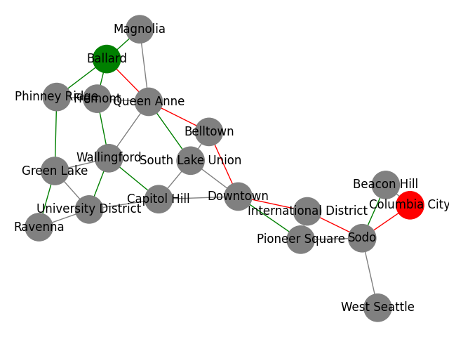
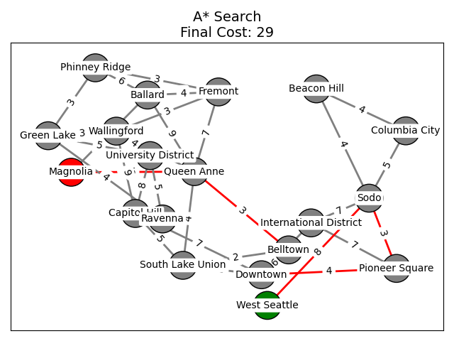

[](https://classroom.github.com/online_ide?assignment_repo_id=16342788&assignment_repo_type=AssignmentRepo)
# Homework- Search 🔍🗺️📌🕵️

Topics: BFS, DFS, and A*

## Part 0 - Pre-req

The code uses the NetworkX library [networkx.org](https://networkx.org/) for graph generation and rendering. Documentation can be found [here](https://networkx.org/documentation/stable/tutorial.html). To install, use the command:

```bash
pip install networkx
```

and follow any instructions. Some people have had experinces where pip is not installed. You can find instructions for your environment here [https://pip.pypa.io/en/stable/installation/](https://pip.pypa.io/en/stable/installation/).

If not already installed from other packages, you may also need `numpy` and `matplotlib`. Use the command:

```bash
pip install numpy matplotlib
```

to add those packages.

## Part 1 - Instructions

This assignment is meant to ensure that you:

* Understand the concepts of uninformed and informed search
* Can utilize NetworkX to traverse a graph along edges
* Experience with different search algorithms
* Are able to visualize graphs
* Can argue for chosing one algorithm over another in different contexts

This assignment will provide the following map of Seattle by [The Point Studio](https://dribbble.com/shots/16375676-The-Emerald-City):

[](seattle.png)

Your task is to write a program that will ask the user for a starting neighborhood as well as a destination/goal neighborhood. Then it will find three different paths using BFS, DFS, and A* between those locations. You are encouraged to use generative AI as a basis to get you started yet know that **it does have issues with visualizing with NetworkX**. A weighted graph overlay is provided here:

[](seattle_markup.png)

This marked version includes the average driving time between the neighborhoods as the weights of edges showing which are connected and which are not. The grid overlay is for calculating the heuristic _h(x)_ using Euclidean distance. Since your A* search should work on any path between two neighborhoods in the graph, you will need to calculate the proper distance using the coordinate space each time.

You will need to create a datafile that encodes all of the graph information for the given Seattle image into a format which can be read by your program when creating a NetworkX graph. **DO NOT HARDCODE** the graph inside of your Python code.

You will update the [search.py](search.py) file to:

1. Utilize Breath-First-Search, Depth-First Search, and A* Search algorithms built into NetworkX.
2. Complete the functions `mybfs`, `mydfs`, and `myastar` functions to return their respective searches.
    * With BFS and DFS the functions accept a graph, source, and goal returning a list of edges stored as tuples in expansion order i.e. `[(0,1),(0,2),...]`
    * With A*, it returns a tuple containing a list for the complete path from the source to the goal, followed by the total actual cost of that path i.e. `([0,5,9,3],42)`
3. Write functions to visualize the searches on a given graph and save the images to display in the README.
4. Answer the questions in the reflection.

Also note that for A*, the output format of `(path,cost)` is saying to return a tuple containing two items. The first is a list of nodes called `path` like `[4,9,3,11]` and the second item is a number representing the cost of the path taking the sum of all of the weights along the edges. There is a function built into `nx` that will compute this for you.

*Imporant* 2: There isn't just one correct way to visualize the graphs. Please visit [NetworkX's documentation](https://networkx.org/documentation/stable/tutorial.html) for lots of additional resources and examples.

Below is an example screenshot drawing a graph with different colored edges (yours does not need to look like this) given the following code:

```python
    # add main code here
    G = nx.balanced_tree(5,2)
    source = 0
    target = 9
    bfs = mybfs(G, source, target)
    print(bfs)
    colors = ['red' if edge in bfs else 'blue' for edge in G.edges()]
    markers = ['green' if node in [source,target] else 'blue' for node in G.nodes()]
    nx.draw(G, edge_color = colors, node_color = markers, with_labels=True)
    plt.savefig("example_bfs.png") #or use plt.show() to display
```


And to visualize a weighted graph edit the following code:

```python
    G = nx.gnm_random_graph(15, 32, seed=0)
    random.seed(0)
    for (u,v) in G.edges():
        G.edges[u,v]['weight'] = random.randint(1,42)
    pos=nx.circular_layout(G)
    nx.draw_networkx(G,pos)
    labels = nx.get_edge_attributes(G,'weight')
    nx.draw_networkx_edge_labels(G,pos,edge_labels=labels)
    plt.savefig("example_astar.png")
```

It creates the following image:


Modify the documentation in the program's comments to describe the changes you made and document your code. Test your program against the Arad to Bucharest example from [Russel & Norvig](https://courses.cs.washington.edu/courses/cse599j/12sp/calendar/Astar.PDF).

## Part 2 - Generated Images

The images that you generate need to show all of the edges that were expanded as part of the search (except for A* since the built-in only gives the final path), but also clearly identify the final path generated by the search algorith. Below each section, add three clearly labeled images showing the results of the prompted routes. Inside of each image plot, add a footnote (or figure text or title or something similar) that shows the final cost of the path found.

Image1- A*

Image2-BFS

Image3-DFS
### Connect Ballard to Columbia City





### Connect West Seattle to Magnolia





## Part 3 - Reflection

Update the README to answer the following questions:

1. ChatGPT describes BFS as

    ```text
    Breadth-first search (BFS) is an algorithm for traversing or searching tree or graph data structures. It starts at the tree root (or some arbitrary node of a graph, sometimes referred to as a 'search key') and explores the neighbor nodes first, before moving to the next level neighbours. It uses a queue data structure to keep track of the next node to visit. It is used to find the shortest path between two nodes in a graph.
    ```

    Summarize and then explain what ChatGPT gets right about BFS and what it misses out on.
    ```text
   BFS is a graph or tree traversal algorithm. It begins at root node in a graph and explores all its neighbors before moving to the neighbors of those neighbors. 
   BFS uses a queue data structure to keep track of which nodes to visit next, and it guarantees the shortest path between two nodes in an unweighted graph.
   What GPT gets right about BFS:
      •	Starting Point: BFS starts from a root or any node in a graph.
      •	Neighbor Exploration: It explores neighbors first before moving to the next level.
      •	Queue Usage: BFS uses a queue to track nodes for exploration.
      •	Shortest Path: It finds the shortest path in unweighted graphs.
   
   What GPT misses out on about BFS:
   •	Cycle Handling: It doesn’t mention the need to track visited nodes to avoid cycles.
   •	Queue Behavior: Doesn’t explain the queue’s FIFO (First In, First Out) behavior clearly.
   •	Weighted Graphs: Doesn’t clarify that BFS is for unweighted graphs, not for weighted ones.
   •	Tree vs. Graph: Doesn’t emphasize that trees don’t need cycle handling, while graphs do.
   ```

2. I asked ChatGPT "Does it make sense to use BFS on a Binary Search Tree?" ... it responded with:

    It can make sense to use Breadth-first search (BFS) on a Binary Search Tree (BST) in certain situations. One of those situations is when we need to traverse the entire tree level by level, for example, printing all the elements of the tree level by level. The output will be sorted since it is a binary search tree.

    Another example of using BFS on a BST is when we want to find the shortest path between two nodes. Since a BST has the property of being ordered, the shortest path between two nodes is the path that goes through the least number of levels. Since BFS visits the nodes level by level, it will find the shortest path between the two nodes.

    However, in most cases, it is more efficient to use the in-order, pre-order, or post-order traversal specific to BSTs, since they are designed to take advantage of the tree's ordered structure.
    

    Explain why ChatGPT is completely wrong.
    
     ```text
   Wrong statement: “The output will be sorted since it is a binary search tree.”
   
   Why it’s wrong: A Binary Search Tree (BST) is structured so that in-order traversal (not BFS) visits nodes in sorted order. BFS traverses the tree level by level, which does not guarantee a sorted order.
     For example, consider the BST: BFS would visit nodes in the order: 10, 5, 15, 3, 7, 12, 18, which is not sorted.
   
   10            

   /  \
   
   5    15
   
   / \   / \
   
   3   7 12  18
   
   Wrong statement: “BFS will find the shortest path between two nodes.”
   Why it’s wrong:
     1. BSTs are specifically structured for efficient searching using depth-first search (DFS), particularly in-order traversal or directly navigating left and right child nodes.
    2. Finding the shortest path between two nodes in a BST is simply a matter of following the structure of the tree:
        a. If both nodes are less than the current node, go left; if both are greater, go right. This can be done more efficiently by DFS or a direct search, without the need for a BFS.
       b. BFS doesn’t take advantage of the BST’s ordered structure and is inefficient compared to a simple traversal like DFS.
   
   Misuse of BFS for Binary Search Tree operations:

   Wrong implication: “BFS is useful for pathfinding in a BST.”
   Why it’s wrong:
   1. In a BST, pathfinding is usually just following the structure of the tree (left or right child). BFS traverses the entire tree level by level, which introduces unnecessary overhead for finding nodes in an ordered structure.
   2. DFS or a simple comparison-based search is far more efficient in a BST because it directly exploits the BST’s properties. BFS would unnecessarily check sibling nodes at each level, which is inefficient for BST lookups.

   Correct Way:
     
   1. In-order traversal is the standard method for producing sorted output from a BST.
   2. For searching or pathfinding in a BST, a direct DFS-based approach that leverages the tree’s structure (e.g., go left if the target is smaller, go right if 
      it’s larger) is faster than BFS.

3. Explain when greedy searching can perform worse than uninformed search. Create a graph that demonstrates this and include the generated images below. _Hint_ you may need to create some fake data but in the same format that you used to encode the Seattle data.
```text
   
   Here are scenarios where Greedy Search can perform worse than uninformed search:

   **Misleading Heuristic:**
   Greedy search chooses the next node based on the heuristic's estimate of the distance to the goal.
   If the heuristic is not accurate or is poorly chosen, it can lead the search down suboptimal paths (local minima) that seem closer to the goal according to the heuristic but are actually 
   farther in terms of the true path cost.
   For example, if the heuristic guides the search to a dead-end or a longer route, the search will still follow that path because it appears closer to the goal.
   
   **Heuristic Ignores Path Cost:**
   Greedy search does not consider the accumulated path cost from the start node to the current node. It only looks ahead using the heuristic.
   In contrast, some uninformed searches like Uniform Cost Search (UCS) or even Breadth-First Search (BFS) can find shorter or optimal paths because they systematically explore all nodes up to 
   a certain depth or cost.
   If the path that looks closer to the goal has high accumulated costs, Greedy search will still choose it, potentially resulting in a much longer total path.
   
   **Local Minima Traps:**
   In some search spaces, there may be nodes that appear closer to the goal (according to the heuristic), but from which it is impossible or expensive to reach the actual goal.
   Greedy search can get "trapped" in these local minima because it always chooses the seemingly closest option based on the heuristic, rather than considering other potential paths that could 
   be better in the long run.
   
   **No Guarantee of Finding a Solution:**
   If the heuristic function does not cover all possible paths, Greedy search may fail to find a solution even when one exists, because it does not systematically 
   explore all nodes like BFS or DFS.
   Uninformed search algorithms, especially BFS, can guarantee finding a solution if one exists because they explore all possible paths at a given depth before 
   moving to the next level.
   
   Image1- Misleading heuristic
   
   Image2- Uniform Cost Search
```
   
   
   
   
   Python code - https://github.com/CS5100-Seattle-Fall24/graphsearch-saumya-mt/blob/main/Ans_three.py


4. Try reversing directions and going from Columbia City to Ballad. Do you get the same resulting paths for each of the algorithms? Explain why or why not and show the new images below.
 ```text
   
   BFS may find different paths in an undirected graph because the order of exploration can change based on the starting point.
   DFS almost always results in different paths for reversed directions, as it depends heavily on the order in which nodes are explored.
   A* finds paths with the same total cost in both directions due to symmetric edge weights, but the order of traversal can differ because the algorithm may 
   prioritize nodes differently depending on the search direction.
   These images show path from Columbia city to Ballard
   
   Image1-A*
   
   Image2-BFS
   
   Image3-DFS
```
   
   
   
   


5. What are your thoughts about this homework? Did you find any parts particularly challenging? What changes would you make to improve the learning experience for future students?
 ```text
   
   Homework was good, increased the conceptual clarity of all the algorithms. Nothing challenging in particular just required a lot of Internet surfing for 
   conceptual clarity.
```
