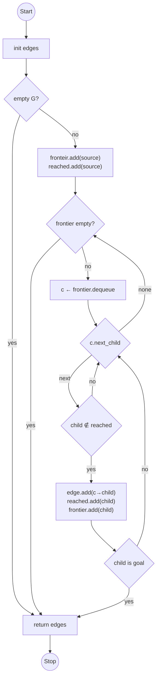
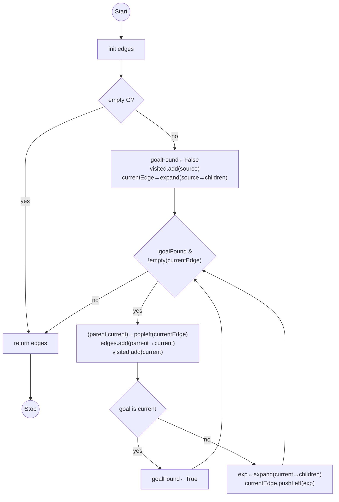
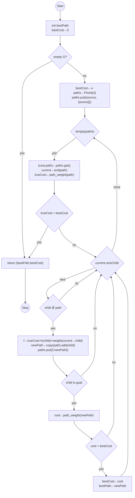

# Search Algorithms

A description of the search techniques used for this assignment. This flowchart is written in pseudocode so do not expect the statements to align with Python exactly.

## BFS

Note: The left arrow (←) means assign to. The right arrow (→) means edge or the tuple connecting the parent to a child. The `child.next` statment means create a way to iterate through all of the children of a node like `for child in G.adj[current]` or using the `children` function from networkx.

---

## DFS

Note: This version pops from the left and pushes on the left, which is reversed from the normal stack. The expand function is meant to give a list of edges from the node to its children. This is because expanding is usually done in order, instead of in reverse, so you can use a normal stack (or recursion) if you reverse the node order, so the results will be in-order.

---

## A*

Notes: In Python, the way to calculate the cost of a path is use the built in `path_weight` function like `nx.path_weight(G, mypath, weight="weight")`. To access the weight between two nodes use `G.edges[u, v]['weight']` where `u` and `v` are two different nodes. For a Priority Queue, feel free to use an already built version via this import statment `from queue import PriorityQueue` at the beginning of your program.
